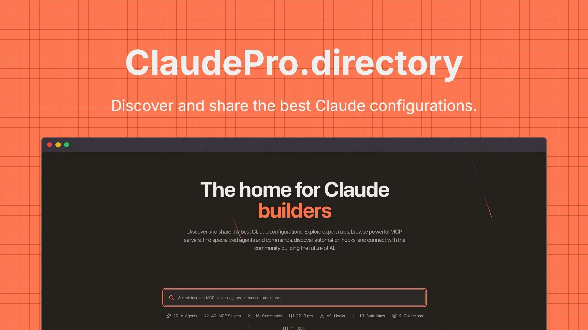

# Claude Pro Directory

**Discover and share the best Claude configurations**
255+ expert rules, powerful MCP servers, specialized agents, automation hooks, and more.

[🌐 Website](https://claudepro.directory) • [💬 Discord](https://discord.gg/Ax3Py4YDrq) • [🐦 Twitter](https://x.com/JSONbored) • [💼 Discussions](https://github.com/JSONbored/claudepro-directory/discussions)

---

## 🎯 What is Claude Pro Directory?

**Stop starting from scratch.** A searchable collection of 255+ pre-built Claude configurations with instant setup, task-specific optimization, and weekly community updates.

Whether you need Claude to review code like a senior engineer, write like a professional author, or analyze data like a scientist - find it in seconds, copy, and start using.

## 🚀 Quick Start

### For Users

1. **[Visit claudepro.directory](https://claudepro.directory)**
2. **Search or browse** for configurations
3. **Copy** the configuration
4. **Paste** into Claude
5. **Start using** your enhanced Claude immediately

No account needed. No downloads. Just better AI conversations.

### For Contributors

Want to share your Claude configurations with the community?

1. **Use [GitHub issue templates](https://github.com/JSONbored/claudepro-directory/issues/new/choose)** (web submit form coming soon)
2. **Add** your configuration via issue template or PR
3. **Help** others work smarter with Claude

See our [Contributing Guide](.github/CONTRIBUTING.md) for detailed instructions.

---

## 📚 Content Catalog

Browse all available Claude configurations by category:

## 🤖 Agents (37)

Specialized AI personas for specific development workflows and expert assistance

- **[Agent Skills Framework Engineer](https://claudepro.directory/agents/agent-skills-framework-engineer)** - Agent Skills framework specialist for creating procedural knowledge files, domain-specific expertise, and skill-based agent capabilities using Anthropic's new Skills system.
- **[Ai Code Review Security Agent](https://claudepro.directory/agents/ai-code-review-security-agent)** - AI-powered code review specialist focusing on security vulnerabilities, OWASP Top 10, static analysis, secrets detection, and automated security best practices enforcement
- **[Ai Devops Automation Engineer Agent](https://claudepro.directory/agents/ai-devops-automation-engineer-agent)** - AI-powered DevOps automation specialist focused on predictive analytics, self-healing systems, CI/CD optimization, and intelligent infrastructure management
- **[Api Builder Agent](https://claudepro.directory/agents/api-builder-agent)** - Specialized agent for designing, building, and optimizing RESTful APIs and GraphQL services with modern best practices
- **[Autogen Conversation Agent Builder](https://claudepro.directory/agents/autogen-conversation-agent-builder)** - AutoGen v0.4 conversation agent specialist using actor model architecture for building multi-turn dialogue systems with cross-language messaging and real-time tool invocation
- **[Backend Architect Agent](https://claudepro.directory/agents/backend-architect-agent)** - Expert backend architect specializing in scalable system design, microservices, API development, and infrastructure planning
- **[Claude Haiku 45 Speed Optimizer Agent](https://claudepro.directory/agents/claude-haiku-45-speed-optimizer-agent)** - Speed-optimized agent leveraging Haiku 4.5's 2x performance and 3x cost savings, delivering 90% of Sonnet's agentic capability for rapid iterations.
- **[Claude Mcp Skills Integration Agent](https://claudepro.directory/agents/claude-mcp-skills-integration-agent)** - MCP Skills integration specialist for remote server configuration, tool permissions, multi-MCP orchestration, and Claude Desktop ecosystem workflows.
- **[Claude Md Knowledge Manager Agent](https://claudepro.directory/agents/claude-md-knowledge-manager-agent)** - CLAUDE.md specialist for creating, maintaining, and optimizing project-specific AI instructions that survive context compaction and guide development.
- **[Cloud Infrastructure Architect Agent](https://claudepro.directory/agents/cloud-infrastructure-architect-agent)** - Multi-cloud infrastructure specialist focused on AWS, GCP, and Azure architecture, cost optimization, disaster recovery, high availability, and cloud-native design patterns
- **[Code Reviewer Agent](https://claudepro.directory/agents/code-reviewer-agent)** - Expert code reviewer that provides thorough, constructive feedback on code quality, security, performance, and best practices
- **[Codebase Migration Refactoring Agent](https://claudepro.directory/agents/codebase-migration-refactoring-agent)** - AI agent specialized in large-scale codebase migrations and behavior-preserving refactoring. Handles framework upgrades, library migrations, legacy code modernization, and systematic refactoring for Claude Code.
- **[Context Window Optimizer Agent](https://claudepro.directory/agents/context-window-optimizer-agent)** - Context window optimization specialist managing 1M+ token conversations, preventing truncation with smart summarization and session management strategies.
- **[Data Pipeline Engineering Agent](https://claudepro.directory/agents/data-pipeline-engineering-agent)** - Modern data pipeline specialist focused on real-time streaming, ETL/ELT orchestration, data quality validation, and scalable data infrastructure with Apache Airflow, dbt, and cloud-native tools
- **[Database Specialist Agent](https://claudepro.directory/agents/database-specialist-agent)** - Expert database architect and optimizer specializing in SQL, NoSQL, performance tuning, and data modeling
- **[Debugging Assistant Agent](https://claudepro.directory/agents/debugging-assistant-agent)** - Advanced debugging agent that helps identify, analyze, and resolve software bugs with systematic troubleshooting methodologies
- **[Domain Specialist Ai Agents](https://claudepro.directory/agents/domain-specialist-ai-agents)** - Industry-specific AI agents for healthcare, legal, and financial domains with specialized knowledge, compliance automation, and regulatory requirements
- **[Extended Thinking Orchestrator](https://claudepro.directory/agents/extended-thinking-orchestrator)** - Orchestrate Extended Thinking modes with adaptive budget allocation. Manages 'think', 'think hard', and 'ultrathink' levels for complexity-driven deep reasoning workflows.
- **[Frontend Specialist Agent](https://claudepro.directory/agents/frontend-specialist-agent)** - Expert frontend developer specializing in modern JavaScript frameworks, UI/UX implementation, and performance optimization
- **[Full Stack Ai Development Agent](https://claudepro.directory/agents/full-stack-ai-development-agent)** - Full-stack AI development specialist bridging frontend, backend, and AI/ML with AI-assisted coding workflows, intelligent code generation, and end-to-end type safety
- **[Github Copilot Interop Bridge](https://claudepro.directory/agents/github-copilot-interop-bridge)** - Bridge Claude Code and GitHub Copilot workflows with Haiku 4.5 integration. Enables cross-platform agent coordination, model switching, and hybrid enterprise workflows.
- **[Life Sciences Research Specialist](https://claudepro.directory/agents/life-sciences-research-specialist)** - Automate biomedical research workflows with Claude for Life Sciences. Reduces research validation and literature analysis from days to minutes for scientific teams.
- **[Multi Agent Orchestration Specialist](https://claudepro.directory/agents/multi-agent-orchestration-specialist)** - Multi-agent orchestration specialist using LangGraph and CrewAI for complex, stateful workflows with graph-driven reasoning and role-based agent coordination
- **[Parallel Subagent Distributor](https://claudepro.directory/agents/parallel-subagent-distributor)** - Parallel subagent workload distribution specialist coordinating concurrent Claude Code subagents for massive speedups using native parallel execution capabilities.
- **[Performance Optimizer Agent](https://claudepro.directory/agents/performance-optimizer-agent)** - Expert in application performance optimization, profiling, and system tuning across frontend, backend, and infrastructure
- **[Plugin Ecosystem Architect](https://claudepro.directory/agents/plugin-ecosystem-architect)** - Design and publish Claude Code plugins for the October 2025 marketplace launch. Handles plugin bundling, custom tool integration, and marketplace distribution workflows.
- **[Product Management Ai Agent](https://claudepro.directory/agents/product-management-ai-agent)** - AI-powered product management specialist focused on user story generation, product analytics, roadmap prioritization, A/B testing, and data-driven decision making
- **[Production Reliability Engineer](https://claudepro.directory/agents/production-reliability-engineer)** - Ensure production deployment reliability with SRE best practices. Monitors deployments, implements self-healing systems, and manages incident response for Claude Code apps.
- **[Prompt Optimization Specialist](https://claudepro.directory/agents/prompt-optimization-specialist)** - Optimize agent prompts and system instructions with meta-prompting techniques. Improves prompt performance through A/B testing, chaining, and ROI measurement.
- **[Semantic Kernel Enterprise Agent](https://claudepro.directory/agents/semantic-kernel-enterprise-agent)** - Microsoft Semantic Kernel enterprise agent specialist for building Azure-native AI applications with multi-language SDK support, plugin governance, and enterprise-grade deployment
- **[Slash Command Orchestrator Agent](https://claudepro.directory/agents/slash-command-orchestrator-agent)** - Slash command specialist for creating and orchestrating custom Claude workflows with dynamic arguments, conditional logic, and multi-step automation.
- **[Subagent Factory Agent](https://claudepro.directory/agents/subagent-factory-agent)** - Subagent architecture specialist creating specialized agents for delegation, parallel execution, and modular task decomposition in Claude Code workflows.
- **[Technical Documentation Writer Agent](https://claudepro.directory/agents/technical-documentation-writer-agent)** - Specialized in creating clear, comprehensive technical documentation for APIs, software, and complex systems
- **[Test Automation Engineer Agent](https://claudepro.directory/agents/test-automation-engineer-agent)** - Expert in automated testing strategies, test frameworks, and quality assurance across unit, integration, and end-to-end testing
- **[Token Cost Budget Optimizer](https://claudepro.directory/agents/token-cost-budget-optimizer)** - Analyze and optimize token costs with real-time budget tracking. Provides cost projection, usage analytics, and model selection recommendations using Sonnet/Haiku pricing.
- **[Ui Ux Design Expert Agent](https://claudepro.directory/agents/ui-ux-design-expert-agent)** - Specialized in creating beautiful, intuitive user interfaces and exceptional user experiences
- **[Web Async Agent Coordinator](https://claudepro.directory/agents/web-async-agent-coordinator)** - Web-based asynchronous agent coordinator leveraging Claude Code for Web's browser interface for managing long-running autonomous coding tasks with async workflows.

## ⚙️ MCP Servers (40)

Model Context Protocol servers for extending Claude's capabilities

- **[Airtable Mcp Server](https://claudepro.directory/mcp/airtable-mcp-server)** - Read and write records, manage bases and tables in Airtable directly from Claude
- **[Asana Mcp Server](https://claudepro.directory/mcp/asana-mcp-server)** - Interact with Asana workspaces to manage projects and tasks
- **[Aws Services Mcp Server](https://claudepro.directory/mcp/aws-services-mcp-server)** - Comprehensive AWS cloud services integration for infrastructure management, deployment, and monitoring
- **[Box Mcp Server](https://claudepro.directory/mcp/box-mcp-server)** - Access enterprise content, analyze unstructured data, and automate workflows
- **[Canva Mcp Server](https://claudepro.directory/mcp/canva-mcp-server)** - Browse, summarize, and generate Canva designs directly from Claude
- **[Clickup Mcp Server](https://claudepro.directory/mcp/clickup-mcp-server)** - Task management and project tracking with ClickUp integration
- **[Cloudflare Mcp Server](https://claudepro.directory/mcp/cloudflare-mcp-server)** - Build applications, analyze traffic, and manage security settings through Cloudflare
- **[Cloudinary Mcp Server](https://claudepro.directory/mcp/cloudinary-mcp-server)** - Upload, manage, transform, and analyze media assets in the cloud
- **[Daloopa Mcp Server](https://claudepro.directory/mcp/daloopa-mcp-server)** - Access high-quality fundamental financial data from SEC filings and investor presentations
- **[Discord Mcp Server](https://claudepro.directory/mcp/discord-mcp-server)** - Discord bot integration for community management, moderation, and server automation
- **[Docker Mcp Server](https://claudepro.directory/mcp/docker-mcp-server)** - Manage Docker containers, images, and services directly through Claude with comprehensive Docker API integration
- **[Figma Mcp Server](https://claudepro.directory/mcp/figma-mcp-server)** - Access designs, export assets, and interact with Figma files through Claude
- **[Filesystem Mcp Server](https://claudepro.directory/mcp/filesystem-mcp-server)** - Official MCP server providing secure file system operations for Claude Desktop and Claude Code
- **[Fireflies Mcp Server](https://claudepro.directory/mcp/fireflies-mcp-server)** - Extract valuable insights from meeting transcripts and summaries
- **[Git Mcp Server](https://claudepro.directory/mcp/git-mcp-server)** - Official MCP server providing Git repository tools for reading, searching, and manipulating Git repositories
- **[Github Mcp Server](https://claudepro.directory/mcp/github-mcp-server)** - Official GitHub MCP server providing comprehensive GitHub API access for repository management, file operations, and search functionality
- **[Hubspot Mcp Server](https://claudepro.directory/mcp/hubspot-mcp-server)** - Access and manage HubSpot CRM data including contacts, companies, and deals
- **[Hugging Face Mcp Server](https://claudepro.directory/mcp/hugging-face-mcp-server)** - Access Hugging Face Hub and Gradio AI applications
- **[Intercom Mcp Server](https://claudepro.directory/mcp/intercom-mcp-server)** - Access customer conversations, tickets, and user data in real-time
- **[Invideo Mcp Server](https://claudepro.directory/mcp/invideo-mcp-server)** - Build video creation capabilities into your applications
- **[Jam Mcp Server](https://claudepro.directory/mcp/jam-mcp-server)** - Debug faster with AI agents that access video recordings, console logs, and network requests
- **[Jira Mcp Server](https://claudepro.directory/mcp/jira-mcp-server)** - Manage Jira tickets and Confluence documentation
- **[Kubernetes Mcp Server](https://claudepro.directory/mcp/kubernetes-mcp-server)** - Kubernetes cluster management and container orchestration through MCP integration
- **[Linear Mcp Server](https://claudepro.directory/mcp/linear-mcp-server)** - Integrate with Linear's issue tracking and project management system
- **[Monday Mcp Server](https://claudepro.directory/mcp/monday-mcp-server)** - Manage monday.com boards, items, and CRM activities
- **[Netlify Mcp Server](https://claudepro.directory/mcp/netlify-mcp-server)** - Create, deploy, and manage websites on Netlify platform
- **[Notion Mcp Server](https://claudepro.directory/mcp/notion-mcp-server)** - Read docs, update pages, and manage tasks in Notion workspaces
- **[Paypal Mcp Server](https://claudepro.directory/mcp/paypal-mcp-server)** - Integrate PayPal commerce capabilities, payment processing, and transaction management
- **[Plaid Mcp Server](https://claudepro.directory/mcp/plaid-mcp-server)** - Analyze, troubleshoot, and optimize Plaid integrations for banking data and financial account linking
- **[Postgresql Mcp Server](https://claudepro.directory/mcp/postgresql-mcp-server)** - Official MCP server providing read-only access to PostgreSQL databases with schema inspection and query capabilities
- **[Reddit Mcp Buddy](https://claudepro.directory/mcp/reddit-mcp-buddy)** - Browse Reddit, search posts, and analyze user activity directly from Claude - no API keys required
- **[Redis Mcp Server](https://claudepro.directory/mcp/redis-mcp-server)** - Official Redis MCP server providing natural language interface for Redis data management and operations
- **[Sentry Mcp Server](https://claudepro.directory/mcp/sentry-mcp-server)** - Monitor errors, debug production issues, and track application health
- **[Socket Mcp Server](https://claudepro.directory/mcp/socket-mcp-server)** - Security analysis and vulnerability scanning for dependencies
- **[Square Mcp Server](https://claudepro.directory/mcp/square-mcp-server)** - Build on Square APIs for payments, inventory, and order management
- **[Stripe Mcp Server](https://claudepro.directory/mcp/stripe-mcp-server)** - Payment processing, subscription management, and financial transaction handling
- **[Stytch Mcp Server](https://claudepro.directory/mcp/stytch-mcp-server)** - Configure and manage Stytch authentication services and workspace settings
- **[Vercel Mcp Server](https://claudepro.directory/mcp/vercel-mcp-server)** - Manage deployments, analyze logs, and control Vercel projects
- **[Workato Mcp Server](https://claudepro.directory/mcp/workato-mcp-server)** - Access any application, workflows, or data via Workato's integration platform
- **[Zapier Mcp Server](https://claudepro.directory/mcp/zapier-mcp-server)** - Connect to nearly 8,000 apps through Zapier's automation platform

## 🪝 Hooks (65)

Event-driven automation scripts that run on specific triggers

- **[Accessibility Checker](https://claudepro.directory/hooks/accessibility-checker)** - Automated accessibility testing and compliance checking for web applications following WCAG guidelines
- **[Api Endpoint Documentation Generator](https://claudepro.directory/hooks/api-endpoint-documentation-generator)** - Automatically generates or updates API documentation when endpoint files are modified
- **[Auto Code Formatter Hook](https://claudepro.directory/hooks/auto-code-formatter-hook)** - Automatically formats code files after Claude writes or edits them using Prettier, Black, or other formatters
- **[Auto Save Backup](https://claudepro.directory/hooks/auto-save-backup)** - Automatically creates timestamped backups of files before modification to prevent data loss
- **[Aws Cloudformation Validator](https://claudepro.directory/hooks/aws-cloudformation-validator)** - Validates AWS CloudFormation templates for syntax errors and best practices
- **[Cloud Backup On Session Stop](https://claudepro.directory/hooks/cloud-backup-on-session-stop)** - Automatically backs up changed files to cloud storage when session ends
- **[Code Complexity Alert Monitor](https://claudepro.directory/hooks/code-complexity-alert-monitor)** - Alerts when code complexity exceeds thresholds in real-time
- **[Code Test Runner Hook](https://claudepro.directory/hooks/code-test-runner-hook)** - Automatically run relevant tests when code changes are detected, with intelligent test selection and parallel execution
- **[Css Unused Selector Detector](https://claudepro.directory/hooks/css-unused-selector-detector)** - Detects unused CSS selectors when stylesheets are modified to keep CSS lean
- **[Database Connection Cleanup](https://claudepro.directory/hooks/database-connection-cleanup)** - Closes all database connections and cleans up resources when session ends
- **[Database Migration Runner](https://claudepro.directory/hooks/database-migration-runner)** - Automated database migration management with rollback capabilities, validation, and multi-environment support
- **[Database Query Performance Logger](https://claudepro.directory/hooks/database-query-performance-logger)** - Monitors and logs database query performance metrics with slow query detection, N+1 analysis, and optimization suggestions
- **[Dead Code Eliminator](https://claudepro.directory/hooks/dead-code-eliminator)** - Automatically detects and removes unused code, imports, and dependencies with safe deletion verification and rollback support
- **[Dependency Security Audit On Stop](https://claudepro.directory/hooks/dependency-security-audit-on-stop)** - Performs a comprehensive security audit of all dependencies when session ends
- **[Dependency Security Scanner](https://claudepro.directory/hooks/dependency-security-scanner)** - Real-time vulnerability scanning for dependencies with automated CVE detection, severity assessment, and patch recommendations
- **[Dependency Update Checker](https://claudepro.directory/hooks/dependency-update-checker)** - Automatically checks for outdated dependencies and suggests updates with security analysis
- **[Discord Activity Notifier](https://claudepro.directory/hooks/discord-activity-notifier)** - Sends development activity updates to Discord channel for team collaboration
- **[Docker Container Auto Rebuild](https://claudepro.directory/hooks/docker-container-auto-rebuild)** - Automatically rebuilds Docker containers when Dockerfile or docker-compose.yml files are modified
- **[Docker Image Security Scanner](https://claudepro.directory/hooks/docker-image-security-scanner)** - Comprehensive Docker image vulnerability scanning with layer analysis, base image recommendations, and security best practices enforcement
- **[Documentation Auto Generator On Stop](https://claudepro.directory/hooks/documentation-auto-generator-on-stop)** - Automatically generates or updates project documentation when session ends
- **[Documentation Coverage Checker](https://claudepro.directory/hooks/documentation-coverage-checker)** - Automated documentation coverage analysis with missing docstring detection, API documentation validation, and completeness scoring
- **[Documentation Generator](https://claudepro.directory/hooks/documentation-generator)** - Automatically generates and updates project documentation from code comments, README files, and API definitions
- **[Environment Cleanup Handler](https://claudepro.directory/hooks/environment-cleanup-handler)** - Cleans up temporary files, caches, and resources when Claude session ends
- **[Environment Variable Validator](https://claudepro.directory/hooks/environment-variable-validator)** - Validates environment variables, checks for required vars, and ensures proper configuration across environments
- **[Error Rate Monitor](https://claudepro.directory/hooks/error-rate-monitor)** - Tracks error patterns and alerts when error rates spike
- **[File Size Warning Monitor](https://claudepro.directory/hooks/file-size-warning-monitor)** - Alerts when files exceed size thresholds that could impact performance
- **[Final Bundle Size Reporter](https://claudepro.directory/hooks/final-bundle-size-reporter)** - Analyzes and reports final bundle sizes when the development session ends
- **[Git Auto Commit On Stop](https://claudepro.directory/hooks/git-auto-commit-on-stop)** - Automatically commits all changes with a summary when Claude Code session ends
- **[Git Branch Protection](https://claudepro.directory/hooks/git-branch-protection)** - Prevents direct edits to protected branches like main or master, enforcing PR-based workflows
- **[Git Pre Commit Validator](https://claudepro.directory/hooks/git-pre-commit-validator)** - Comprehensive pre-commit hook that validates code quality, runs tests, and enforces standards
- **[Github Actions Workflow Validator](https://claudepro.directory/hooks/github-actions-workflow-validator)** - Validates GitHub Actions workflow files for syntax errors and best practices
- **[Go Module Tidy](https://claudepro.directory/hooks/go-module-tidy)** - Automatically runs go mod tidy when Go files or go.mod are modified to keep dependencies clean
- **[Graphql Schema Validator](https://claudepro.directory/hooks/graphql-schema-validator)** - Validates GraphQL schema files and checks for breaking changes when modified
- **[I18n Translation Validator](https://claudepro.directory/hooks/i18n-translation-validator)** - Validates translation files for missing keys and ensures consistency across different language files
- **[Jest Snapshot Auto Updater](https://claudepro.directory/hooks/jest-snapshot-auto-updater)** - Automatically updates Jest snapshots when component files are modified significantly
- **[Json Schema Validator](https://claudepro.directory/hooks/json-schema-validator)** - Validates JSON files against their schemas when modified to ensure data integrity
- **[Kubernetes Manifest Validator](https://claudepro.directory/hooks/kubernetes-manifest-validator)** - Validates Kubernetes YAML manifests for syntax and best practices when modified
- **[Markdown Link Checker](https://claudepro.directory/hooks/markdown-link-checker)** - Validates all links in markdown files to detect broken links and references
- **[Memory Usage Monitor](https://claudepro.directory/hooks/memory-usage-monitor)** - Monitors memory usage and alerts when thresholds are exceeded
- **[Nextjs Route Analyzer](https://claudepro.directory/hooks/nextjs-route-analyzer)** - Analyzes Next.js page routes and generates a route map when pages are added or modified
- **[Package Vulnerability Scanner](https://claudepro.directory/hooks/package-vulnerability-scanner)** - Scans for security vulnerabilities when package.json or requirements.txt files are modified
- **[Performance Benchmark Report](https://claudepro.directory/hooks/performance-benchmark-report)** - Runs performance benchmarks and generates comparison report when session ends
- **[Performance Impact Monitor](https://claudepro.directory/hooks/performance-impact-monitor)** - Monitors and alerts on performance-impacting changes in real-time
- **[Performance Monitor](https://claudepro.directory/hooks/performance-monitor)** - Monitors application performance metrics, identifies bottlenecks, and provides optimization recommendations
- **[Playwright Test Runner](https://claudepro.directory/hooks/playwright-test-runner)** - Automatically runs Playwright E2E tests when test files or page components are modified
- **[Prisma Schema Sync](https://claudepro.directory/hooks/prisma-schema-sync)** - Automatically generates Prisma client and creates migrations when schema.prisma is modified
- **[Python Import Optimizer](https://claudepro.directory/hooks/python-import-optimizer)** - Automatically sorts and optimizes Python imports using isort when Python files are modified
- **[Python Linter Integration](https://claudepro.directory/hooks/python-linter-integration)** - Automatically runs pylint on Python files after editing to enforce code quality standards
- **[React Component Test Generator](https://claudepro.directory/hooks/react-component-test-generator)** - Automatically creates or updates test files when React components are modified
- **[Real Time Activity Tracker](https://claudepro.directory/hooks/real-time-activity-tracker)** - Tracks all Claude Code activities in real-time and logs them for monitoring and debugging
- **[Redis Cache Invalidator](https://claudepro.directory/hooks/redis-cache-invalidator)** - Automatically clears relevant Redis cache keys when data model files are modified
- **[Rust Cargo Check](https://claudepro.directory/hooks/rust-cargo-check)** - Automatically runs cargo check and clippy when Rust files are modified
- **[Scss Auto Compiler](https://claudepro.directory/hooks/scss-auto-compiler)** - Automatically compiles SCSS/Sass files to CSS when they are modified
- **[Security Scanner Hook](https://claudepro.directory/hooks/security-scanner-hook)** - Automated security vulnerability scanning that integrates with development workflow to detect and prevent security issues before deployment
- **[Sensitive Data Alert Scanner](https://claudepro.directory/hooks/sensitive-data-alert-scanner)** - Scans for potential sensitive data exposure and alerts immediately
- **[Session Metrics Collector](https://claudepro.directory/hooks/session-metrics-collector)** - Collects and reports detailed metrics about the coding session when Claude stops
- **[Slack Progress Notifier](https://claudepro.directory/hooks/slack-progress-notifier)** - Sends progress updates to Slack channel for team visibility on Claude's activities
- **[Svelte Component Compiler](https://claudepro.directory/hooks/svelte-component-compiler)** - Automatically compiles and validates Svelte components when they are modified
- **[Team Summary Email Generator](https://claudepro.directory/hooks/team-summary-email-generator)** - Generates and sends a comprehensive summary email to the team when session ends
- **[Terraform Plan Executor](https://claudepro.directory/hooks/terraform-plan-executor)** - Automatically runs terraform plan when .tf files are modified to preview infrastructure changes
- **[Test Coverage Final Report](https://claudepro.directory/hooks/test-coverage-final-report)** - Generates a comprehensive test coverage report when the coding session ends
- **[Typescript Compilation Checker](https://claudepro.directory/hooks/typescript-compilation-checker)** - Automatically runs TypeScript compiler checks after editing .ts or .tsx files to catch type errors early
- **[Vue Composition Api Linter](https://claudepro.directory/hooks/vue-composition-api-linter)** - Lints Vue 3 components for Composition API best practices and common issues
- **[Webpack Bundle Analyzer](https://claudepro.directory/hooks/webpack-bundle-analyzer)** - Analyzes webpack bundle size when webpack config or entry files are modified
- **[Workflow Completion Report](https://claudepro.directory/hooks/workflow-completion-report)** - Generates a comprehensive report when Claude Code workflow stops, including files modified, tests run, and git status

## 🔧 Commands (26)

Quick-action slash commands for common development tasks

- **[Autogen Workflow](https://claudepro.directory/commands/autogen-workflow)** - Orchestrate multi-agent workflows using Microsoft AutoGen v0.4 with role-based task delegation, conversation patterns, and collaborative problem solving
- **[Checkpoint Manager](https://claudepro.directory/commands/checkpoint-manager)** - Manage Claude Code checkpoints to safely rewind code changes, restore conversation states, and explore alternatives without fear using ESC+ESC or /rewind commands
- **[Claudemd Builder](https://claudepro.directory/commands/claudemd-builder)** - Generate project-specific CLAUDE.md files with coding standards, architecture notes, and context preservation for team-wide AI consistency and efficient onboarding
- **[Context Analyzer](https://claudepro.directory/commands/context-analyzer)** - Analyze codebase context with agentic search to understand architecture, patterns, and dependencies before major refactors or feature implementations
- **[Cursor Rules](https://claudepro.directory/commands/cursor-rules)** - Generate .cursorrules files for AI-native development with project-specific patterns, coding standards, and intelligent context awareness
- **[Debug](https://claudepro.directory/commands/debug)** - Advanced debugging assistant with root cause analysis, step-by-step troubleshooting, and automated fix suggestions
- **[Docs](https://claudepro.directory/commands/docs)** - Intelligent documentation generator with API specs, code examples, tutorials, and interactive guides
- **[Explain](https://claudepro.directory/commands/explain)** - Intelligent code explanation with visual diagrams, step-by-step breakdowns, and interactive examples
- **[Generate Tests](https://claudepro.directory/commands/generate-tests)** - Automatically generate comprehensive test suites including unit tests, integration tests, and edge cases with multiple testing framework support
- **[Git Smart Commit](https://claudepro.directory/commands/git-smart-commit)** - Intelligently analyzes changes and creates well-formatted git commits with conventional commit messages
- **[Hooks Generator](https://claudepro.directory/commands/hooks-generator)** - Create automated Claude Code hooks that execute shell commands at specific lifecycle points for deterministic control over formatting, testing, linting, and notifications
- **[Mcp Setup](https://claudepro.directory/commands/mcp-setup)** - Configure and connect MCP servers to Claude Code with OAuth authentication, tool access, and remote server support for seamless external integrations
- **[Mintlify Docs](https://claudepro.directory/commands/mintlify-docs)** - Generate beautiful, searchable documentation using Mintlify with AI-powered content generation, API reference automation, and MDX components
- **[Optimize](https://claudepro.directory/commands/optimize)** - Advanced performance optimization with bottleneck analysis, memory profiling, and automated improvements
- **[Plan Mode](https://claudepro.directory/commands/plan-mode)** - Activate Claude's extended thinking mode with multi-level planning depth from 'think' to 'ultrathink' for comprehensive strategy creation before implementation
- **[Refactor](https://claudepro.directory/commands/refactor)** - Intelligent code refactoring command that analyzes code structure and applies best practices for improved maintainability and performance
- **[Review](https://claudepro.directory/commands/review)** - Comprehensive code review with security analysis, performance optimization, and best practices validation
- **[Security](https://claudepro.directory/commands/security)** - Comprehensive security audit with vulnerability detection, threat analysis, and automated remediation recommendations
- **[Security Audit](https://claudepro.directory/commands/security-audit)** - Deploy 100 specialized sub-agents for comprehensive enterprise-grade security, performance, and optimization audit of production codebase
- **[Skills Installer](https://claudepro.directory/commands/skills-installer)** - Install and manage Claude Code Agent Skills - specialized knowledge packages that extend Claude's capabilities with domain expertise and progressive disclosure
- **[Slash Command Gen](https://claudepro.directory/commands/slash-command-gen)** - Create custom slash commands for Claude Code with templates, arguments, frontmatter metadata, and team-shared workflows stored in .claude/commands directory
- **[Subagent Create](https://claudepro.directory/commands/subagent-create)** - Create specialized Claude Code subagents with custom system prompts, scoped tool access, and independent context for parallel task execution and workflow orchestration
- **[Tdd Workflow](https://claudepro.directory/commands/tdd-workflow)** - Implement test-driven development workflows with Claude Code using red-green-refactor cycles, automatic test generation, and AI-guided iteration until all tests pass
- **[Test Advanced](https://claudepro.directory/commands/test-advanced)** - Advanced test suite generator with property-based testing, mutation testing, and intelligent test case discovery
- **[V0 Generate](https://claudepro.directory/commands/v0-generate)** - Generate production-ready React components from natural language using V0.dev patterns with shadcn/ui, TailwindCSS, and TypeScript
- **[Zod Audit](https://claudepro.directory/commands/zod-audit)** - Production codebase auditor specialized in Zod schema validation coverage, security vulnerability detection, and dead code elimination

## 📜 Rules (26)

Custom instructions and guidelines for specialized AI behaviors

- **[Ai Prompt Engineering Expert](https://claudepro.directory/rules/ai-prompt-engineering-expert)** - Expert in AI prompt engineering with focus on coding tasks, test-driven development patterns, iterative refinement, and context management for optimal AI assistance
- **[Api Design Expert](https://claudepro.directory/rules/api-design-expert)** - Transform Claude into a comprehensive API design specialist focused on RESTful APIs, GraphQL, OpenAPI, and modern API architecture patterns
- **[Api First Development Architect](https://claudepro.directory/rules/api-first-development-architect)** - API-first development expert with OpenAPI/Swagger schema design, tRPC type-safe procedures, REST best practices, GraphQL federation, and contract-driven development for scalable backend architectures.
- **[Aws Cloud Architect](https://claudepro.directory/rules/aws-cloud-architect)** - Expert AWS architect with deep knowledge of cloud services, best practices, and Well-Architected Framework
- **[Biome Strict Linting Rules](https://claudepro.directory/rules/biome-strict-linting-rules)** - Biome linting rules configuration for code quality validation. Strict enforcement, custom overrides, VCS integration, and automated fixes for TypeScript.
- **[Code Review Expert](https://claudepro.directory/rules/code-review-expert)** - Comprehensive code review rules for thorough analysis and constructive feedback
- **[Database Expert](https://claudepro.directory/rules/database-expert)** - Transform Claude into a database specialist with expertise in SQL, NoSQL, database design, optimization, and modern data architectures
- **[Devops Sre Expert](https://claudepro.directory/rules/devops-sre-expert)** - Transform Claude into a DevOps/SRE specialist with expertise in cloud infrastructure, CI/CD, monitoring, and automation
- **[Go Golang Expert](https://claudepro.directory/rules/go-golang-expert)** - Transform Claude into a Go language expert with deep knowledge of concurrency, performance optimization, and idiomatic Go
- **[Graphql Federation Specialist](https://claudepro.directory/rules/graphql-federation-specialist)** - Expert in GraphQL Federation architecture for microservices, specializing in Apollo Federation, schema composition, and distributed graph patterns
- **[Kubernetes Devsecops Engineer](https://claudepro.directory/rules/kubernetes-devsecops-engineer)** - Expert in Kubernetes DevSecOps with GitOps workflows, pod security standards, RBAC, secret management, and automated security scanning for production clusters
- **[Mobile App Development Expert](https://claudepro.directory/rules/mobile-app-development-expert)** - Expert in iOS, Android, and cross-platform mobile development with React Native, Flutter, and native frameworks
- **[Monorepo Workspace Manager](https://claudepro.directory/rules/monorepo-workspace-manager)** - Monorepo workspace management expert with Turborepo, pnpm workspaces, Nx integration, package coordination, and cross-package dependency optimization for scalable multi-package repositories.
- **[Nextjs 15 Performance Architect](https://claudepro.directory/rules/nextjs-15-performance-architect)** - Expert in Next.js 15 performance optimization with Turbopack, partial prerendering, advanced caching strategies, and Core Web Vitals excellence
- **[Production Codebase Auditor](https://claudepro.directory/rules/production-codebase-auditor)** - Expert in comprehensive production codebase analysis with Zod validation enforcement, security vulnerability detection, and code consolidation strategies
- **[Python Data Science Expert](https://claudepro.directory/rules/python-data-science-expert)** - Transform Claude into a data science specialist with expertise in Python, machine learning, and data analysis
- **[React 19 Concurrent Features Specialist](https://claudepro.directory/rules/react-19-concurrent-features-specialist)** - React 19 concurrent features specialist with useTransition, useDeferredValue, Suspense boundaries, streaming SSR, and selective hydration patterns
- **[React Next Js Expert](https://claudepro.directory/rules/react-next-js-expert)** - Transform Claude into a React and Next.js specialist with deep knowledge of modern patterns, performance optimization, and best practices
- **[React Server Components Expert](https://claudepro.directory/rules/react-server-components-expert)** - Expert in React Server Components (RSC) with React 19 and Next.js 15, specializing in server-first rendering patterns, data fetching strategies, and streaming architectures
- **[Security Auditor Penetration Tester](https://claudepro.directory/rules/security-auditor-penetration-tester)** - Configure Claude as a security expert for vulnerability assessment, penetration testing, and security best practices
- **[Security First React Components](https://claudepro.directory/rules/security-first-react-components)** - Security-first React component architect with XSS prevention, CSP integration, input sanitization, and OWASP Top 10 mitigation patterns
- **[Terraform Infrastructure Architect](https://claudepro.directory/rules/terraform-infrastructure-architect)** - Expert in Terraform infrastructure as code with AI-assisted generation, modular patterns, state management, and multi-cloud deployments
- **[Test Driven Development Enforcer](https://claudepro.directory/rules/test-driven-development-enforcer)** - Test-driven development expert enforcing red-green-refactor cycles, Vitest/Jest configuration, test coverage requirements, mocking strategies, and test-first coding discipline for robust software development.
- **[Typescript 5x Strict Mode Expert](https://claudepro.directory/rules/typescript-5x-strict-mode-expert)** - TypeScript 5.x strict mode expert with template literal types, strict null checks, type guards, and ESLint integration for enterprise-grade type safety
- **[Wcag Accessibility Auditor](https://claudepro.directory/rules/wcag-accessibility-auditor)** - Expert in WCAG 2.2 Level AA accessibility compliance, automated testing tools, ARIA patterns, and inclusive design for web applications
- **[Windsurf Ai Native Ide Patterns](https://claudepro.directory/rules/windsurf-ai-native-ide-patterns)** - Windsurf AI-native IDE specialist with Cascade AI, multi-file context awareness, and Flow collaboration patterns for Claude integration

## 📚 Skills (26)

Task-focused capability guides and specialized expertise

- **[Audio Transcription and Summarization](https://claudepro.directory/skills/audio-transcription-summarization)** - Transcribe audio with Whisper/ffmpeg and produce structured, timestamped summaries and action items.
- **[Bun Runtime Modern JavaScript](https://claudepro.directory/skills/bun-runtime-modern-javascript)** - Build high-performance JavaScript applications with Bun, the all-in-one runtime challenging Node.js. Native TypeScript support, built-in bundler, and 3x faster package installs.
- **[CLI Data Viz Quickstart](https://claudepro.directory/skills/cli-data-viz-quickstart)** - Turn CSV/JSON into quick charts from the command line; export PNG/SVG for reports.
- **[Cloudflare Workers AI Edge Functions](https://claudepro.directory/skills/cloudflare-workers-ai-edge)** - Deploy AI models and serverless functions to Cloudflare's global edge network with sub-5ms cold starts and 40% edge computing market share.
- **[CSV & Excel Data Wrangler](https://claudepro.directory/skills/csv-excel-data-wrangler)** - Clean, filter, join, pivot, and export CSV/XLSX data reliably with reproducible steps.
- **[Cursor/Windsurf AI IDE Setup & Optimization](https://claudepro.directory/skills/cursor-windsurf-ai-ide-setup)** - Configure and optimize Cursor and Windsurf AI code editors for maximum productivity. Agent mode, composer features, keybindings, and AI-powered refactoring workflows.
- **[DOCX Report Generator](https://claudepro.directory/skills/docx-report-generator)** - Fill templated DOCX with data to produce reports/invoices, with images and PDF export.
- **[FastAPI Python Backend Expert](https://claudepro.directory/skills/fastapi-python-backend)** - Build high-performance async REST APIs with FastAPI, Python's fastest-growing web framework. Automatic OpenAPI docs, type validation with Pydantic, and async/await support.
- **[GitHub Actions AI-Powered CI/CD Automation](https://claudepro.directory/skills/github-actions-ai-cicd)** - Build intelligent CI/CD pipelines with GitHub Actions, AI-assisted workflow generation, automated testing, and deployment orchestration.
- **[Image OCR and Table Extraction](https://claudepro.directory/skills/image-ocr-table-extraction)** - Extract text and tabular data from images/scans using Tesseract and OpenCV with preprocessing.
- **[JSON Schema Validation and Transformation](https://claudepro.directory/skills/json-schema-validation-transformation)** - Validate JSON with Ajv/Zod and perform safe, lossless schema migrations and transformations.
- **[Log Parsing and Incident Timeline](https://claudepro.directory/skills/log-parsing-incident-timeline)** - Parse web/app/system logs into structured incidents and timelines with anomaly hints.
- **[Markdown Knowledge Base Composer](https://claudepro.directory/skills/markdown-knowledge-base-composer)** - Aggregate Markdown folders into a cohesive knowledge base with TOC, cross-links, and export.
- **[Mintlify AI Documentation Automation](https://claudepro.directory/skills/mintlify-documentation-automation)** - Automate beautiful, searchable documentation creation with Mintlify, AI-powered content generation from code, and interactive MDX components.
- **[Playwright E2E Testing Automation](https://claudepro.directory/skills/playwright-e2e-testing)** - Automate end-to-end testing with Playwright, AI-powered test generation, and comprehensive browser coverage for modern web applications.
- **[PostgreSQL Query Optimization](https://claudepro.directory/skills/postgresql-query-optimization)** - Analyze and optimize PostgreSQL queries for OLTP and OLAP workloads with AI-assisted performance tuning, indexing strategies, and execution plan analysis.
- **[REST API Client Harness](https://claudepro.directory/skills/rest-api-client-harness)** - Explore and script against REST APIs with auth, pagination, retries, and error handling.
- **[Supabase Realtime Database Builder](https://claudepro.directory/skills/supabase-realtime-database)** - Build full-stack applications with Supabase Postgres, real-time subscriptions, Edge Functions, and pgvector AI integration for 4M+ developers.
- **[Svelte/SvelteKit Full-Stack Developer](https://claudepro.directory/skills/svelte-sveltekit-fullstack)** - Build full-stack web apps with Svelte and SvelteKit. Minimal runtime overhead, reactive components, and server-side rendering. The most admired frontend framework of 2025.
- **[tRPC Type-Safe API Builder](https://claudepro.directory/skills/trpc-type-safe-api)** - Build end-to-end type-safe APIs with tRPC and TypeScript, eliminating code generation and runtime bloat for full-stack applications.
- **[V0 Rapid UI Prototyping Workflow](https://claudepro.directory/skills/v0-rapid-prototyping)** - Build production-ready React components and full pages in minutes using V0.dev AI with shadcn/ui, TailwindCSS v4, and Next.js 15 integration.
- **[Vite Build Optimization Specialist](https://claudepro.directory/skills/vite-build-optimization)** - Optimize frontend build performance with Vite's lightning-fast HMR, code splitting, and tree-shaking. Modern build tooling that's replaced Webpack as the developer favorite.
- **[WebAssembly Module Development](https://claudepro.directory/skills/webassembly-module-development)** - Build high-performance WebAssembly modules with WASI 0.3, multi-language support, and production-ready deployments for web, serverless, and AI workloads.
- **[Website Content Crawler and Summarizer](https://claudepro.directory/skills/website-crawler-summarizer)** - Crawl domains respectfully, extract readable content, dedupe, and generate structured summaries.
- **[Windsurf AI-Native Collaborative Development](https://claudepro.directory/skills/windsurf-collaborative-development)** - Master collaborative AI-assisted development with Windsurf IDE's Cascade AI, multi-file context awareness, and Flow patterns for team workflows.
- **[Zod Schema Validator](https://claudepro.directory/skills/zod-schema-validator)** - Build type-safe runtime validation with Zod for APIs, forms, and data pipelines with TypeScript 5.5+ integration and automatic type inference.

## 💻 Statuslines (26)

Custom status bar displays for your Claude development environment

- **[Accessibility First Statusline](https://claudepro.directory/statuslines/accessibility-first-statusline)** - WCAG-compliant accessible statusline with screen reader announcements, high-contrast colors, semantic labels, keyboard hints, and reduced motion support.
- **[Ai Model Performance Dashboard](https://claudepro.directory/statuslines/ai-model-performance-dashboard)** - Multi-provider AI performance dashboard with context occupancy tracking, truncation warnings, TTFT latency, tokens/min rate, and model comparison metrics.
- **[Api Latency Breakdown](https://claudepro.directory/statuslines/api-latency-breakdown)** - API latency breakdown monitor showing network time vs processing time split, p95 latency tracking, and performance bottleneck detection for Claude Code sessions.
- **[Block Timer Tracker](https://claudepro.directory/statuslines/block-timer-tracker)** - Claude 5-hour conversation block tracker with visual countdown, expiration warnings, and color-coded indicators to prevent unexpected session terminations.
- **[Burn Rate Monitor](https://claudepro.directory/statuslines/burn-rate-monitor)** - Real-time burn rate monitor showing cost per minute, tokens per minute, and projected daily spend to prevent budget overruns during Claude Code sessions.
- **[Cache Efficiency Monitor](https://claudepro.directory/statuslines/cache-efficiency-monitor)** - Claude Code prompt caching efficiency monitor tracking cache hits, write efficiency, and cost savings with visual hit rate indicators and optimization recommendations.
- **[Catppuccin Mocha Theme](https://claudepro.directory/statuslines/catppuccin-mocha-theme)** - Soothing Catppuccin Mocha theme statusline with 26 pastel colors, Powerline separators, and modular segments for Git, model info, and token tracking.
- **[Daily Usage Percentage Tracker](https://claudepro.directory/statuslines/daily-usage-percentage-tracker)** - Claude Code daily usage quota tracker showing percentage of daily limit consumed with visual progress bar, time remaining, and budget pacing indicators.
- **[Docker Health Statusline](https://claudepro.directory/statuslines/docker-health-statusline)** - Docker statusline configuration for Claude Code CLI. Features real-time health monitoring, color-coded indicators, and container tracking. Production-ready.
- **[Five Hour Window Tracker](https://claudepro.directory/statuslines/five-hour-window-tracker)** - Claude Code 5-hour rolling session window tracker with visual progress bar, time remaining countdown, and expiry warnings for usage management.
- **[Git Status Statusline](https://claudepro.directory/statuslines/git-status-statusline)** - Git-focused statusline showing branch, dirty status, ahead/behind indicators, and stash count alongside Claude session info
- **[Lines Per Minute Tracker](https://claudepro.directory/statuslines/lines-per-minute-tracker)** - Real-time coding velocity monitor tracking lines added/removed per minute with productivity scoring and daily output projection for Claude Code sessions.
- **[Mcp Server Status Monitor](https://claudepro.directory/statuslines/mcp-server-status-monitor)** - Real-time MCP server monitoring statusline showing connected servers, active tools, and performance metrics for Claude Code MCP integration
- **[Minimal Powerline](https://claudepro.directory/statuslines/minimal-powerline)** - Clean, performance-optimized statusline with Powerline glyphs showing model, directory, and token count
- **[Model Switch History Tracker](https://claudepro.directory/statuslines/model-switch-history-tracker)** - Claude Code model switch detector tracking transitions between Opus/Sonnet/Haiku with switch count, current model indicator, and cost impact visualization.
- **[Multi Line Statusline](https://claudepro.directory/statuslines/multi-line-statusline)** - Comprehensive multi-line statusline displaying detailed session information across two lines with organized sections and visual separators
- **[Multi Provider Token Counter](https://claudepro.directory/statuslines/multi-provider-token-counter)** - Multi-provider AI token counter displaying real-time context usage for Claude (1M), GPT-4.1 (1M), Gemini 2.x (1M), and Grok 3 (1M) with 2025 verified limits
- **[Multi Session Overlap Indicator](https://claudepro.directory/statuslines/multi-session-overlap-indicator)** - Claude Code multi-session overlap detector showing concurrent active sessions with visual indicators, session count, and workspace collision warnings for budget management.
- **[Oh My Zsh Robbyrussell](https://claudepro.directory/statuslines/oh-my-zsh-robbyrussell)** - Oh-My-Zsh robbyrussell theme replica with iconic arrow prompt, Git status indicators, and directory path for seamless Claude Code shell integration.
- **[Python Rich Statusline](https://claudepro.directory/statuslines/python-rich-statusline)** - Feature-rich statusline using Python's Rich library for beautiful formatting, progress bars, and real-time token cost tracking
- **[Real Time Cost Tracker](https://claudepro.directory/statuslines/real-time-cost-tracker)** - Real-time AI cost tracking statusline with per-session spend analytics, model pricing, and budget alerts
- **[Session Health Score](https://claudepro.directory/statuslines/session-health-score)** - Claude Code session health aggregator providing A-F grade based on cost efficiency, latency performance, productivity velocity, and cache utilization with actionable recommendations.
- **[Session Timer Statusline](https://claudepro.directory/statuslines/session-timer-statusline)** - Time-tracking statusline showing elapsed session duration, tokens per minute rate, and estimated cost with productivity metrics
- **[Simple Text Statusline](https://claudepro.directory/statuslines/simple-text-statusline)** - Ultra-lightweight plain text statusline with no colors or special characters for maximum compatibility and minimal overhead
- **[Starship Powerline Theme](https://claudepro.directory/statuslines/starship-powerline-theme)** - Starship-inspired powerline statusline with Nerd Font glyphs, modular segments, and Git integration for Claude Code
- **[Workspace Project Depth Indicator](https://claudepro.directory/statuslines/workspace-project-depth-indicator)** - Claude Code workspace depth tracker showing monorepo navigation level, project root detection, and directory depth visualization for context awareness.

## 📦 Collections (9)

Curated bundles of configurations for specific use cases

- **[API Development Starter Kit](https://claudepro.directory/collections/api-development-starter-kit)** - Complete toolkit for building and documenting RESTful APIs with automated testing and documentation generation. Perfect for backend developers starting new API projects.
- **[AWS Cloud Infrastructure Bundle](https://claudepro.directory/collections/aws-cloud-infrastructure-bundle)** - Complete AWS infrastructure management toolkit combining cloud architecture expertise, CloudFormation validation, and AWS services integration. Perfect for teams building and maintaining cloud-native applications on AWS.
- **[Backend Development Suite](https://claudepro.directory/collections/backend-development-suite)** - Full-featured backend development environment combining architecture planning, database design, and cloud services integration. Perfect for building scalable server-side applications.
- **[Code Quality & Review Toolkit](https://claudepro.directory/collections/code-quality-toolkit)** - Comprehensive suite of tools for maintaining high code quality through automated reviews, testing, and best practice enforcement. Essential for teams focused on code excellence.
- **[Content Creation Workflow](https://claudepro.directory/collections/content-creation-workflow)** - Streamlined workflow for content creators and marketers. Manage projects across multiple platforms, design graphics, and automate content distribution with integrated tools.
- **[Data Engineering Suite](https://claudepro.directory/collections/data-engineering-suite)** - Comprehensive toolkit for data engineers working with databases, ETL pipelines, and data infrastructure. Includes database design, optimization, and cloud services integration.
- **[Debugging & Troubleshooting System](https://claudepro.directory/collections/debugging-troubleshooting-system)** - Complete debugging toolkit for identifying, analyzing, and resolving complex software issues. Combines AI-assisted debugging with powerful diagnostic commands.
- **[Developer Productivity Booster](https://claudepro.directory/collections/developer-productivity-booster)** - Maximize your development efficiency with automated workflows, smart backups, code formatting, and enhanced visual feedback. This collection combines productivity hooks, informative statuslines, and time-saving commands for a streamlined development experience.
- **[Production Readiness Toolkit](https://claudepro.directory/collections/production-readiness-toolkit)** - Comprehensive system for ensuring code quality, security, and compliance before production deployment. Includes automated code reviews, complexity monitoring, backup strategies, and production-grade rules for professional development teams.

---

## 📈 Activity

## 👥 Contributors

Thanks to everyone who has contributed to making Claude better for everyone!

<!-- ALL-CONTRIBUTORS-LIST:START - Do not remove or modify this section -->
<!-- prettier-ignore-start -->
<!-- markdownlint-disable -->
<!-- Add contributors here -->
<!-- markdownlint-enable -->
<!-- prettier-ignore-end -->
<!-- ALL-CONTRIBUTORS-LIST:END -->

---

**Built with ❤️ by [@JSONbored](https://github.com/JSONbored)**

[Website](https://claudepro.directory) • [GitHub](https://github.com/JSONbored/claudepro-directory) • [Discord](https://discord.gg/Ax3Py4YDrq) • [License](LICENSE)

