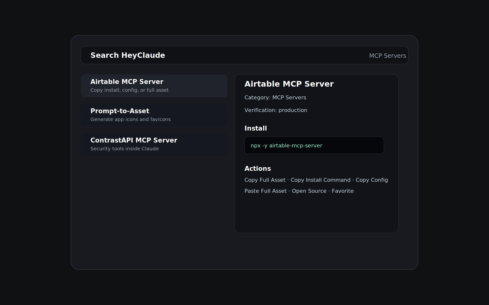

# HeyClaude

Search HeyClaude from Raycast and copy practical Claude assets without opening a browser first.



## What You Can Do

- Search agents, MCP servers, skills, rules, commands, hooks, guides, collections, and statuslines.
- Open dedicated category commands such as `Search Agents`, `Search Skills`,
  and `Search MCP Servers` when you want a narrower list immediately.
- Filter by category or local favorites.
- Inspect the native Raycast detail view before using an entry.
- Review structured metadata for category, brand, trust, source, platform, and
  verification details.
- Copy or paste the full usable asset.
- Copy install commands and Claude config snippets separately.
- Copy canonical URLs, Markdown links, summaries, and brand domains.
- Create Raycast Quicklinks for entries, categories, jobs, feeds, and common
  HeyClaude pages.
- Create Raycast Snippets from install commands and config snippets.
- Open the HeyClaude page, documentation, or source repository.
- Open issue-first contribution and change-request URLs in the browser.
- Open `Submit New Content` for a guided category-specific submission form.
- Open `Get Involved with HeyClaude` for newsletter, GitHub, API, jobs,
  community, and support links.
- Browse active HeyClaude jobs, inspect role details, favorite roles, and open
  external employer apply links.
- Keep frequently used entries and jobs higher in local results through
  Raycast frecency sorting.

## Read-Only by Design

This first release does not write to project files, `.claude/settings.json`, `.cursor/rules`, hooks, commands, local skill folders, GitHub, or HeyClaude job data. It only fetches the public HeyClaude feeds, stores local caches, stores local favorites and local ranking signals, copies/pastes text, creates user-approved Raycast Quicklinks/Snippets, and opens links.

Contribution actions are also read-only in Raycast. They open HeyClaude submit or GitHub issue URLs in the browser and do not request GitHub OAuth, tokens, forks, branches, pull requests, or local project-file access.

## Data and Privacy

The extension reads:

- `https://heyclau.de/data/raycast-index.json`
- Per-entry detail JSON under `https://heyclau.de/data/raycast/...`
- `https://heyclau.de/api/jobs?limit=100`

Raycast `Cache` stores the latest successful registry feed, entry details, and jobs feed so search still works after a network failure. Raycast `LocalStorage` stores favorite entry and job keys plus Raycast frecency ranking data. No analytics, accounts, tokens, or project-file access are used.

## Development

```bash
npm install
npm run dev
```

Production builds have no endpoint or feed override preference. `npm run dev`
temporarily injects a maintainer-only development preference, then restores the
production manifest when Raycast development mode exits.

For preview-feed QA during `npm run dev`, open the HeyClaude extension
preferences and set `Developer Feed URL Override` to:

```text
https://heyclaude-dev.zeronode.workers.dev/data/raycast-index.json
```

Leave the preference blank to exercise production endpoints from the development
extension. All commands share this single dev-only setting. Registry detail
payloads and the jobs API host are resolved relative to the selected feed URL,
so a dev feed also loads dev detail files and dev D1 jobs.

## Validation

```bash
npm run test:junit
npm run lint
npm run build
```

The site feed can be checked from the repository root:

```bash
pnpm validate:raycast-feed
```
